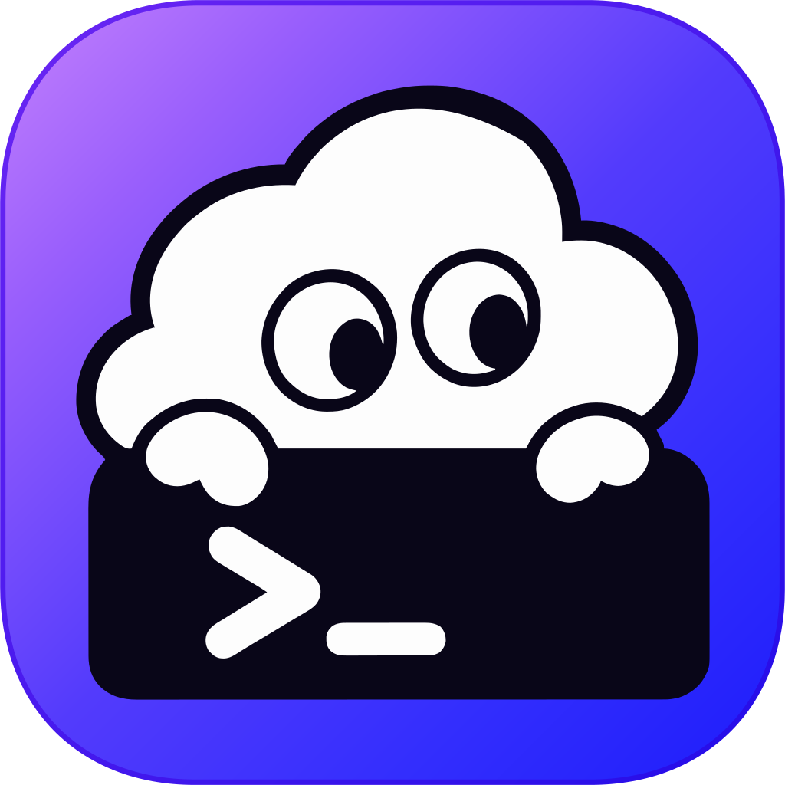

<p align="center">
  
</p>

<h1 align="center">CGswitch</h1>

<p align="center">
  An open-source all-in-one desktop manager for OpenAI Codex and Claude Code.<br />
  Switch provider profiles for either client in one click, manage your ChatGPT accounts, and centrally manage MCP servers, plugins, and Skills.
</p>

<p align="center">
  <a href="README.zh-CN.md">中文</a> ·
  <a href="https://github.com/zeno528/CGswitch/releases/latest">Latest release</a> ·
  <a href="CHANGELOG.md">Changelog</a> ·
  <a href="https://github.com/zeno528/CGswitch/issues">Issues</a>
</p>

<p align="center">
  <a href="https://github.com/zeno528/CGswitch/releases/latest"></a>
  <a href="LICENSE"></a>
  
  
</p>

CGswitch is built for developers who use OpenAI Codex or Claude Code and works with those clients' local environments on your computer. It brings provider profiles, ChatGPT OAuth accounts, MCP servers, plugins, and Skills into one desktop app, reducing the need to move between configuration files and separate tools.

## How CGswitch fits into your workflow

```text
Provider preset or existing client configuration
                         ↓
                  Saved as a profile
                         ↓
            Edit · test · apply · restore
```

Codex and Claude Code are managed side by side: each client has its own provider page, and applying a profile on one never rewrites the other. CGswitch backs up the relevant files before applying a profile. Provider profiles stay separate from global MCP, Plugins, and Skills, so switching providers does not require reconfiguring those resources.

## Features

### Codex provider profiles

- Start from a built-in provider preset, capture the current `~/.codex/config.toml`, or create a custom provider.
- Edit `config.toml`, `models.json`, and `auth.json` with TOML/JSON validation.
- Fetch available models from a provider's `/models` endpoint and select them in the profile editor.
- Rename, duplicate, reorder, delete, and apply profiles.
- Keep unrelated Codex configuration such as MCP and plugin sections when applying provider-specific changes where possible.
- Set a custom display name, provider icon, administration URL, optional description, and optional ChatGPT account binding. The description stays inside CGswitch and is not written into the Codex configuration.

### Supported provider presets

Each built-in preset declares which clients it supports and fills in the endpoint, model, and regional endpoints separately for each side.

- **Codex** — `ChatGPT`, `DeepSeek`, `MiniMax`, `Zhipu`, `OpenCode`, `OpenRouter`, `Xiaomi MiMo`, `Kimi`, `Qwen`, `Tencent Hunyuan`, `Volcengine Doubao`, `Baidu Qianfan`, `xAI (Grok)`, and `Custom`.
- **Claude Code** — `Anthropic API`, `Claude Account`, `DeepSeek`, `MiniMax`, `Zhipu`, `OpenRouter`, `Xiaomi MiMo`, `Kimi`, `Qwen`, `Tencent Hunyuan`, `Volcengine Doubao`, `Baidu Qianfan`, and `Custom`.

Presets available on both clients share a name and icon but never share endpoints or models. Custom providers can use the Responses API-compatible configuration supported by Codex, or the Anthropic-compatible configuration supported by Claude Code, with their own endpoint, key, and model catalog.

### Claude Code providers

- Start from a built-in Claude preset, save the current `~/.claude/settings.json` as a snapshot, or create a custom provider.
- Provider fields are written into the `env` block of `~/.claude/settings.json`. The whole file stays editable with JSON validation, and every other top-level key and `env` entry is preserved.
- Pick the `Anthropic-compatible` protocol and a CN or Global endpoint for third-party gateways; the key is written as `ANTHROPIC_AUTH_TOKEN` or `ANTHROPIC_API_KEY` depending on the preset.
- Map request models onto Claude Code's model roles — Main, Fable, Opus, Sonnet, Haiku, and Subagent — or add a custom `/model` entry. The `1M` flag appends `[1m]` to a model ID to request a million-token context.
- `Claude Account` uses the account already signed in to Claude Code: run `/login` there first. Applying it removes third-party endpoint and credential overrides from `settings.json`, and CGswitch neither reads nor stores login credentials.
- Test connectivity against the real `/v1/messages` call path using the stored credentials. Fetching a model list is a separate, optional step — a gateway that exposes no model catalog still passes the connection test.
- Save shared fields as a common template and fill them into any profile. Endpoints, credentials, model mappings, and app-controlled fields are excluded, and template changes never rewrite existing profiles.
- Turn the balance or usage indicator on or off per profile, on the presets that support querying it (currently DeepSeek and MiniMax).
- Advanced options cover auto-compact and its window, effort level, agent teams, auto memory, hiding AI attribution, bypass permissions, and showing shell file changes.

### ChatGPT accounts and usage

- Sign in to ChatGPT in the system browser via OAuth.
- Manage multiple accounts, choose a default account, and bind an account to a provider profile.
- Test ChatGPT authentication and inspect quota information when available.
- Test third-party provider connectivity, including response status and latency.
- View provider balance or usage indicators for supported providers; ChatGPT quota is handled separately.

### MCP management

- Switch the MCP page between Codex and Claude Code. Codex manages the global `[mcp_servers.*]` configuration in `~/.codex/config.toml`; Claude Code manages the user-scope MCP configuration in `~/.claude.json`.
- Configure local `STDIO` servers and remote `HTTP` / Streamable HTTP servers.
- Edit commands, arguments, URLs, bearer-token environment variables, headers, environment variables, and timeouts.
- Test server connectivity and inspect the tools a server provides; probes go through the system proxy and each client is probed and cached separately.
- Enabling, disabling, or uninstalling a server affects only the client you are on — the other client's servers and configuration are left as they are.
- Switch between a structured form and source editing — TOML for Codex, JSON for Claude Code — with validation and formatting.
- Compare the live Codex configuration with CGswitch's database mirror before syncing either direction.

### Plugins and Skills

- List installed Codex plugins and inspect their versions, capabilities, contents, source, and install path.
- Browse bundled and external plugin marketplaces.
- Install states in marketplace catalogs stay consistent with the Codex desktop app — plugins installed here are recognized there directly.
- Installed plugins are listed first in marketplace catalogs; search matches plugin names only via Ctrl/Cmd+K.
- Installing a plugin that requires sign-in prompts you to authorize it in the Codex desktop app.
- Add marketplaces from GitHub shorthand, Git, SSH, or a local marketplace directory.
- Preview and install a plugin from a GitHub repository, optionally using a branch or subdirectory.
- Check and upgrade third-party marketplace plugins, or uninstall plugins through the Codex CLI.
- Import local Skills, preview their `SKILL.md`, detect updates and conflicts, and enable, disable, or delete managed Skills.
- Scan Skills from `~/.codex/skills`, `~/.claude/skills`, and `~/.agents/skills` while keeping the CGswitch Skill registry separate from plugin-contained Skills.
- Enable a managed Skill per client: the Codex and Claude Code copies are toggled independently, and each side shows its own enabled count. Deleting a managed Skill removes the CGswitch copy and both client copies.

### Desktop experience

- Windows and macOS desktop builds powered by Tauri 2.
- Light, dark, and system theme modes.
- English and Simplified Chinese interface languages, with system-language detection.
- Optional launch at login, silent start, and minimize-to-tray behavior.
- System tray menu with quick actions: switch profiles, open settings, jump to accounts, and show the main window. Single-click on the tray icon can be set to either show the main window or open the tray menu.
- Optional Codex restart after applying a Codex profile; Claude Code profiles are applied without restarting anything.
- Optional automatic update checks with release notes before installation, with an "updated to vX" notification on the next launch.
- Local backups of the database, configuration files, and Codex files are created automatically; database backups can be browsed and restored from Settings.

### Settings

The settings page is organized into four tabs:

- **General** — theme, language, launch-at-login, silent start, and minimize-to-tray.
- **App** — single-click tray action, restart Codex after switching, and automatic update checks.
- **Advanced** — database backup management with immediate backup, import/export, auto-backup (frequency and retention), and collapsible backup records.
- **About** — application info card with version, GitHub / changelog links, and the data-path list.

### MCP differences

When the live Codex `config.toml` and CGswitch's MCP mirror drift apart, MCP opens a dedicated diff page that lists every divergent server with a red/green LCS diff and supports batch or single-row `adopt` / `revert` actions.

## Download and installation

Download the latest build from the [GitHub Releases page](https://github.com/zeno528/CGswitch/releases/latest).

| Platform | Recommended asset | Notes |
| --- | --- | --- |
| Windows x64 | `CGswitch-v{VERSION}-Windows-setup.exe` | Standard installer. |
| Windows x64 | `CGswitch-v{VERSION}-Windows.msi` | Useful for deployment or MSI-based installation. |
| macOS Apple Silicon | `CGswitch-v{VERSION}-macOS-arm64.dmg` | For Apple Silicon Macs. |
| macOS Intel | `CGswitch-v{VERSION}-macOS-x64.dmg` | For Intel Macs. |

### macOS first launch

Open the DMG, drag **CGswitch** to **Applications**, and launch it. If macOS blocks the app, first allow it in **System Settings → Privacy & Security**. If it still reports that the app cannot be opened, run:

```bash
xattr -cr /Applications/CGswitch.app
```

Replace the path if you installed the app somewhere else. Official packages are currently published for Windows and macOS; Linux packages are not included.

## Quick start

1. In the **Codex** group, open **Providers**, add a built-in preset or **Custom**, enter the credentials or bind a ChatGPT account, then apply.
2. In the **Claude** group, open **Providers** to configure Claude Code, or save the current `~/.claude/settings.json` as a snapshot.
3. Enable the optional Codex restart behavior in **Settings → App** if you want CGswitch to restart Codex after applying a profile.
4. Use **MCP**, **Plugins**, or **Skill** under **General** to manage the corresponding global resources. MCP is managed one client at a time; Skills can be enabled for both.

## Data and privacy

CGswitch keeps its application data under the current user's home directory. The exact files and folders depend on which features have been used:

```text
~/.cgswitch/
├── settings.json
├── cgswitch.db
├── balance-cache.json
├── logs/
│   └── cgswitch.log
├── update-marker
└── backups/
    ├── config/
    ├── database/
    └── codex-files/
```

CGswitch keeps its run logs under `~/.cgswitch/logs/` (1MB × 10 rotation).

CGswitch never reads or stores a Claude Code sign-in: a `Claude Account` profile only tells Claude Code to drop third-party endpoint and credential overrides. The Claude common template lives in the CGswitch database and is therefore covered by database backups.

API keys, OAuth credentials, profiles, and backups are local data. CGswitch creates backups before relevant configuration writes, but you should still avoid committing or sharing `.cgswitch`, `auth.json`, `~/.claude.json`, API keys, or backup files.

## FAQ and troubleshooting

### What happens when I apply a profile?

CGswitch backs up the relevant files, updates the provider-related Codex configuration, and preserves unrelated configuration areas where possible. Whether Codex restarts afterward is controlled by **Settings → App**.

### Are profiles, MCP, Plugins, and Skills the same thing?

No. Profiles describe model/provider settings; MCP describes tool servers; Plugins are Codex extension packages; Skills are reusable instruction directories. They are managed in separate areas of the application.

### Does CGswitch take over my Claude Code sign-in?

No. Run `/login` in Claude Code itself, then apply the `Claude Account` profile — CGswitch only removes third-party endpoint and credential overrides from `settings.json` so Claude Code uses its own account. It never reads or stores login credentials, and it leaves the shell environment untouched.

### Why can a third-party plugin still fail after a provider is configured?

A model provider configuration does not guarantee that every App or MCP connector plugin can load. Some connector plugins also require compatible official ChatGPT authentication or their own dependencies. Check the plugin's requirements if its package is installed but a connector is unavailable.

### Why did a connection test fail?

For a third-party provider, check the endpoint and API key first. For the official ChatGPT profile, sign in through the account settings and make sure the selected account is still valid.

If the problem persists, search existing [Issues](https://github.com/zeno528/CGswitch/issues) or open a new report with the platform, CGswitch version, and a redacted error message. Do not include API keys or authentication files.

## Development

### Requirements

- Node.js
- pnpm `11.9.0`
- Rust toolchain pinned by [`rust-toolchain.toml`](rust-toolchain.toml)
- The platform prerequisites required by Tauri 2
- CMake and libclang for the subscription HTTP transport; Windows also needs NASM (`choco install cmake llvm nasm`).
  On macOS: `brew install cmake llvm` and set `LIBCLANG_PATH` to `$(brew --prefix llvm)/lib`.

### Install and run

```bash
pnpm install
pnpm dev:tauri
```

`pnpm dev:tauri` starts the Vite frontend and a real Tauri desktop window. For frontend-only browser development, use:

```bash
pnpm dev
```

### Checks and builds

```bash
pnpm typecheck
pnpm test:unit
pnpm check
pnpm build
pnpm build:debug
```

`pnpm check` runs the frontend and Rust quality checks. `pnpm build` creates the web build; `pnpm build:debug` creates a debug Tauri bundle. To package release installers locally:

```bash
pnpm tauri build
```

Release bundles are written under `src-tauri/target/release/bundle/`.

## Architecture

CGswitch is built with Tauri 2 + Rust for native file access and Codex integration, with a React frontend and a local SQLite database.

The main source areas:

```text
src/
├── main.tsx     React entry point
├── style.css    global tokens, layout conventions, and styles
├── presets.ts   built-in provider display metadata
├── icons.ts     bundled provider icon registry
├── types.ts     shared TypeScript types
├── api/         typed IPC methods and browser mock
├── app/         shell, navigation, state, polling, and management data cache
├── assets/      bundled provider icons and resources
├── components/  shared UI components (AppDialog, AppSelect, ConfigTextEditor, …)
├── features/    profiles, claude, mcp, plugins, skills, accounts, settings, updates
└── i18n/        English and Simplified Chinese messages

src-tauri/src/
├── main.rs       executable entry point
├── lib.rs        Tauri runtime, command registration, and plugin setup
├── commands.rs   Tauri command boundary
├── error.rs      typed application errors
├── fsutil.rs     filesystem helpers (atomic write, …)
├── services/     AppContext and use cases (profiles, claude, mcp, plugins, accounts, sync, …)
├── codex/        Codex config files and process management
├── auth/         OAuth and account authentication
├── database.rs   SQLite connection, schema, and migrations
├── models.rs     Rust domain models and command DTOs
├── builtin.rs    built-in provider assets and templates
└── paths.rs      filesystem path helpers
```

## Contributing

Bug reports, feature ideas, documentation improvements, and pull requests are welcome. For code changes, run the relevant checks above and keep credentials, local databases, and generated bundles out of commits.

- [Open an issue](https://github.com/zeno528/CGswitch/issues)
- [View the changelog](CHANGELOG.md)

## License

CGswitch is released under the [MIT License](LICENSE). Some provider icons (`ChatGPT`, `DeepSeek`, `MiniMax`, `OpenCode`, and `Zhipu`) are sourced from [thesvg.org](https://thesvg.org) and keep a source notice in the file; the rest are in-house or sourced separately.
